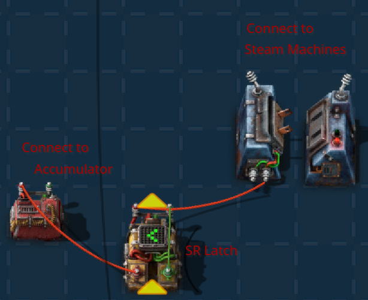
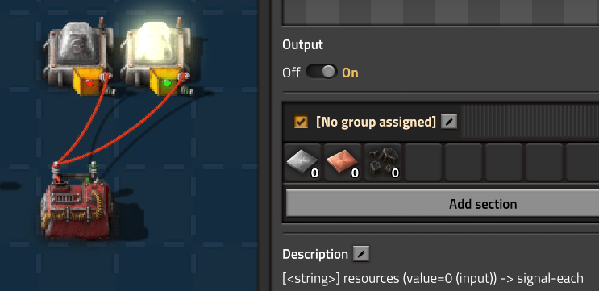
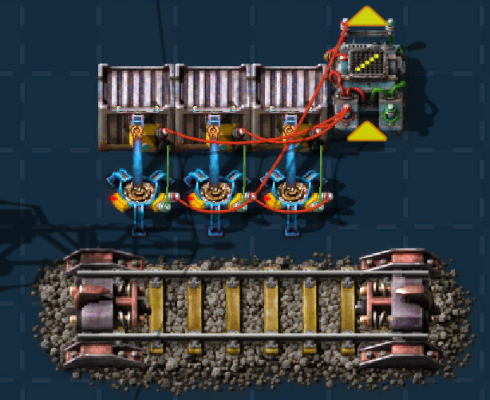

<p align="center">
  
</p>
<h1 align="center">Facto - Write code. Get Factorio circuits.</h1>


<p align="center">
  <a href="https://github.com/Snagnar/Factompiler/actions/workflows/ci.yml"></a>
  <a href="https://codecov.io/gh/Snagnar/Factompiler"></a>
  <a href="https://pypi.org/project/factompile/"></a>
  <a href="https://pypi.org/project/factompile/"></a>
  <a href="https://opensource.org/licenses/MIT"></a>
</p>

<p align="center"> <a href="https://facto.github.io">Try it out with the online compiler!</a> </p>

<div style="width: 100%; overflow-x: auto;">
<table style="width: 100%; table-layout: auto;">
<tr>
<td style="padding-right: 20px; vertical-align: top;">

**Facto** is a programming language that compiles to Factorio circuit network blueprints. You write readable code describing the logic you want, and the compiler generates optimized combinators that you paste directly into your game. No manual wiring, no layout headaches, no remembering signal types, no memory frustration, no debugging visual spaghetti.

```facto
Memory counter: "signal-A";
counter.write((counter.read() + 1) % 20);

Entity lamp = place("small-lamp", 0, 0);
lamp.enable = counter.read() < 30;
```

Run `factompile blink.facto`, copy the output, import it into Factorio, and watch your lamp blink. That's the whole workflow.

</td>
<td>

</td>
</tr>
</table>
</div>

---

## What Facto Does

Facto handles the tedious parts of circuit building so you can focus on logic. The compiler takes care of placing combinators in a sensible layout, routing wires between them (choosing red vs green to avoid signal conflicts), and inserting relay poles when distances exceed 9 tiles. It catches type mismatches at compile time rather than leaving you to debug mysterious in-game behavior.

What Facto doesn't do: it might not produce the most minimal, most compact circuit layouts. The goal is to make circuits that are efficient enough to run well in-game while being easy to read, write, and maintain. If you need absolute minimalism, hand-optimizing the generated blueprint is still an option.

---

## Installation

```bash
pip install factompile
```

Verify it works with `factompile --help`. That's it.

### Try It Instantly

Don't want to create a file? Try compiling directly from the command line:

```bash
factompile -i 'Signal x = 42; Entity lamp = place("small-lamp", 0, 0); lamp.enable = x > 20;'
```

Copy the output blueprint into Factorio and see a lit lamp. Now you're circuit building.

---

## The Language

Facto programs describe circuit networks using four main concepts: signals, memory, entities, and bundles. Here's what each one does and how to use it.

### Signals

Signals are values that flow through circuit networks. Every signal has a type (like `"iron-plate"` or `"signal-A"`) and a value (an integer). You can do arithmetic on signals, and the compiler generates the necessary combinators:

```facto
Signal iron = ("iron-plate", 100);    # Explicit type and value
Signal count = 42;                     # Compiler picks a type
Signal doubled = count * 2;            # Arithmetic combinator
Signal isHigh = count > 50;            # Comparison combinator
Signal copper = iron | "copper-plate";  # Type cast
```

### Conditional Values

Facto has a concise syntax for conditional values: `condition : value`. This outputs `value` when the condition is true, and `0` when false. It compiles to a single decider combinator, making it both readable and efficient:

```facto
Signal capped = (count > 100) : 100;   # 100 if over limit, else 0
Signal passed = (count <= 100) : count; # count if within limit, else 0
Signal clamped = capped + passed;       # Combined: clamped to max 100
```

This compiles more efficiently than the `condition * value` pattern you might use in raw Factorio circuits, where multiplication adds an extra combinator.

### Memory

Memory stores values that persist across game ticks. Without memory, signals exist only for a single tick. Memory cells are implemented as decider combinators feeding back into themselves:

```facto
Memory counter: "signal-A";
counter.write(counter.read() + 1);     # Increment every tick
```

You can make writes conditional, which is how you build latches and state machines:

```facto
Memory buffer: "signal-B";
buffer.write(new_value, when=trigger > 0);   # Only write when triggered

Memory latch: "signal-L";
latch.write(1, set=turn_on > 0, reset=turn_off > 0);  # SR latch
```

### Entities

Entities are Factorio objects you place in the world. You control them by assigning to their properties:

```facto
Entity lamp = place("small-lamp", 0, 0);
lamp.enable = count > 50;              # Turn on when count exceeds 50

Entity inserter = place("fast-inserter", 2, 0);
inserter.enable = chest_full == 0;     # Run when chest isn't full

Entity station = place("train-stop", 5, 0, {station: "Iron Pickup"});
station.send_to_train = departure_signal;
```

The compiler automatically wires entities to the combinators that compute their control signals.

### Bundles

Bundles let you operate on multiple signals at once, using Factorio's "each" wildcard. This is how you build circuits that handle arbitrary item types without hardcoding each one:

```facto
Bundle resources = { ("iron-plate", 100), ("copper-plate", 80), ("coal", 50) };
Bundle doubled = resources * 2;           # Double all values
Signal iron = resources["iron-plate"];    # Access a single signal
Signal anyLow = any(resources) < 20;      # True if any resource is below 20
```

Bundles are powerful for building generic circuits like balanced train loaders that work regardless of what items you're loading.

### Functions

Functions let you reuse logic without copy-pasting combinator setups:

```facto
func clamp(Signal value, int min_val, int max_val) {
    Signal use_min = (value < min_val) : min_val;
    Signal use_max = (value > max_val) : max_val;
    Signal use_val = (value >= min_val && value <= max_val) : value;
    return use_min + use_max + use_val;
}

Signal safe_speed = clamp(raw_speed, 0, 100);
```

Functions are inlined at compile time—there's no runtime call overhead, just shared combinator logic.

### Loops

For loops generate multiple entities at compile time:

```facto
for i in 0..8 {
    Entity lamp = place("small-lamp", i * 2, 0);
    lamp.enable = counter.read() == i;  # Chaser effect
}
```

This places 8 lamps, each enabled when the counter matches its index.

---

## Automatic optimizations

The compiler applies several optimizations automatically. Common subexpressions are shared—if you compute `counter.read() + 1` in three places, it only generates one arithmetic combinator. Compound conditions like `(a > 5) && (b < 10)` fold into a single multi-condition decider combinator (a Factorio 2.0 feature). Adding signals of the same type uses wire merging instead of extra combinators.

Wire routing is handled intelligently. The compiler assigns red and green wire colors to avoid signal conflicts, and inserts medium electric poles as relays when combinators are too far apart. For complex patterns like balanced loaders, it ensures signals merge correctly.

Type checking catches mistakes early:

```
ERROR: Type mismatch: Memory 'buffer' expects 'iron-plate' but write provides 'copper-plate'
WARNING: Mixed signal types in binary operation: 'iron-plate' + 'copper-plate'
```

---

## Documentation

For deeper coverage, see the documentation in the `doc/` directory:

- **[Quick Start](doc/02_quick_start.md)** covers installation and your first program
- **[Signals & Types](doc/03_signals_and_types.md)** explains the type system, arithmetic, and projection
- **[Memory](doc/04_memory.md)** covers counters, latches, and state machines
- **[Entities](doc/05_entities.md)** details placing and controlling Factorio objects
- **[Functions](doc/06_functions.md)** explains reusable logic and imports
- **[Advanced Concepts](doc/07_advanced_concepts.md)** covers optimizations, patterns, and debugging
- **[Library Reference](doc/LIBRARY_REFERENCE.md)** documents the standard library functions

The complete language reference is in [LANGUAGE_SPEC.md](LANGUAGE_SPEC.md), and all available entities and their properties are documented in [doc/ENTITY_REFERENCE.md](doc/ENTITY_REFERENCE.md).


---

## Command Line Usage

```bash
# Compile a file
factompile program.facto                    # Output blueprint to stdout
factompile program.facto -o output.txt      # Save to file

# Compile directly from a string (no file needed!)
factompile -i 'Signal x = 42;'              # Quick one-liner
factompile --input 'Memory m: "signal-A"; m.write(m.read() + 1);'

# Options
factompile program.facto --power-poles medium   # Add power poles
factompile program.facto --name "My Circuit"    # Custom blueprint name
factompile program.facto --log-level debug      # Debug output
factompile program.facto --json                 # Output raw JSON
factompile program.facto --no-optimize          # Skip optimizations
```

The `-i` / `--input` flag is great for quick experiments—try out circuit ideas without creating a file.

---

## Practical Examples

Here are some useful circuits you can build with Facto. If you want a broader range of examples, check the `example_programs/` directory for more.


### RGB Color Cycling Display

A 5×5 lamp grid that smoothly cycles through all colors:

```facto
Memory hue: "signal-H";
hue.write((hue.read() + 1) % 1530);  # Full HSV cycle

Signal h = hue.read();
Signal sector = h / 255;
Signal pos = h % 255;

# HSV to RGB conversion using conditional values
Signal r = ((sector == 0 || sector == 5) : 255)
         + ((sector == 1) : (255 - pos))
         + ((sector == 4) : pos);
Signal g = ((sector == 0) : pos)
         + ((sector == 1 || sector == 2) : 255)
         + ((sector == 3) : (255 - pos));
Signal b = ((sector == 2) : pos)
         + ((sector == 3 || sector == 4) : 255)
         + ((sector == 5) : (255 - pos));

for y in 0..5 {
    for x in 0..5 {
        Entity lamp = place("small-lamp", x, y, 
            {use_colors: 1, always_on: 1, color_mode: 1});
        lamp.r = r | "signal-red";
        lamp.g = g | "signal-green";
        lamp.b = b | "signal-blue";
    }
}
```


### Backup Steam Power

A circuit that turns on backup steam when accumulators drop below 20%, and keeps it running until they reach 80%. The hysteresis prevents flickering when power hovers near the threshold:

```facto
Signal battery = ("signal-A", 0);  # Wire this to your accumulator

Memory steam_on: "signal-A";
steam_on.write(1, set=battery < 20, reset=battery >= 80);

Entity steam_switch = place("power-switch", 0, 0);
steam_switch.enable = steam_on.read() > 0;
```



### Resource Warning System

A simple bundle-based monitor that lights up when any resource runs low:

```facto
# Wire these from your storage chests
Bundle resources = { ("iron-plate", 0), ("copper-plate", 0), ("coal", 0) };

Entity warning_lamp = place("small-lamp", 0, 0);
Entity good_lamp = place("small-lamp", 2, 0);

warning_lamp.enable = any(resources) < 100;
good_lamp.enable = all(resources) > 500;
```




### Balanced Train Loader

The classic MadZuri pattern—inserters only activate when their chest is below the average:

```facto
Entity c1 = place("steel-chest", 0, 0);
Entity c2 = place("steel-chest", 1, 0);
Entity c3 = place("steel-chest", 2, 0);

Bundle total = {c1.output, c2.output, c3.output};
Bundle neg_avg = total / -3;

Entity i1 = place("fast-inserter", 0, 1);
Bundle diff1 = {neg_avg, c1.output};
i1.enable = any(diff1) < 0;

Entity i2 = place("fast-inserter", 1, 1);
Bundle diff2 = {neg_avg, c2.output};
i2.enable = any(diff2) < 0;

Entity i3 = place("fast-inserter", 2, 1);
Bundle diff3 = {neg_avg, c3.output};
i3.enable = any(diff3) < 0;
```



---

## Development

```bash
git clone https://github.com/Snagnar/Factompiler.git
cd Factompiler
pip install -e ".[dev]"

pytest -n auto                    # Run all tests
pytest -m "not end2end" -n auto   # Skip slow end-to-end tests
ruff check . && ruff format .     # Lint and format
```

If you are using VS Code, you can install install this <a href="https://github.com/Snagnar/fcdsl-vscode">facto vscode extension</a>, for code highlighting and basic language support.

---

## Contributing

Contributions are welcome—bug fixes, new features, documentation improvements, or additional test cases. Check [GitHub Issues](https://github.com/Snagnar/Factompiler/issues) for open tasks or open a new issue to discuss what you'd like to work on.

---

## Acknowledgments

Facto builds on [factorio-draftsman](https://github.com/redruin1/factorio-draftsman), the Python library that makes blueprint generation possible. Thanks to the Factorio community for endless circuit inspiration, and to Wube Software for making the best factory game ever.

---

<p align="center">
  <strong>The factory must grow. Now it can grow faster.</strong>
</p>

<p align="center">
  <a href="https://github.com/Snagnar/Factompiler">GitHub</a> •
  <a href="https://pypi.org/project/factompile/">PyPI</a> •
  <a href="LANGUAGE_SPEC.md">Language Spec</a>
</p>

